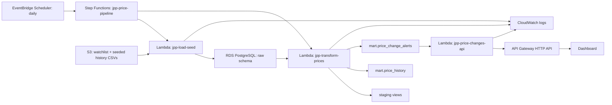

# Jaquar Price Pulse

Serverless data engineering project for tracking historical Jaquar faucet prices from a curated watchlist, modeling price movements, and exposing alert-ready changes through a REST API and dashboard.

## What This Proves

- Python extraction from a real product source
- S3 raw/seed landing
- RDS PostgreSQL storage
- dbt transformation models and data quality tests
- SQL window functions for price-change history
- API-ready mart for products crossing alert thresholds
- AWS architecture using Lambda, Step Functions, EventBridge Scheduler, S3, RDS PostgreSQL, API Gateway, and CloudWatch
- Lightweight dashboard that consumes the live API endpoint

## Live Demo API

```text
https://g1csrs4cxh.execute-api.ap-south-1.amazonaws.com/price-changes?days=14&limit=5
```

The endpoint returns price-change alerts from the PostgreSQL mart table. Query parameters:

- `days`: lookback window from latest available snapshot, default `14`
- `limit`: max records to return, default `50`, max `200`
- `min_pct`: minimum absolute percentage movement, default `0`

## Current Local/RDS Flow

1. Load a 50-SKU watchlist from `data/jaquar_price_watchlist_50.csv`.
2. Load weekly synthetic seed history from `data/jaquar_price_history_seed_synthetic.csv`.
3. Create raw tables in PostgreSQL.
4. Run dbt models:
   - `stg_watchlist`
   - `stg_price_snapshots`
   - `price_history`
   - `price_change_alerts`

The synthetic history is clearly marked with `is_synthetic = true`. It exists to demonstrate time-series transformations before enough real scheduled snapshots accumulate.

## Current AWS Flow

The deployed AWS pipeline currently runs from the uploaded S3 seed files. It does not yet scrape Jaquar live on each schedule.

1. EventBridge Scheduler runs daily.
2. Step Functions starts `jpp-price-pipeline`.
3. `jpp-load-seed` loads the watchlist and seeded history from S3 into RDS.
4. `jpp-transform-prices` rebuilds staging views and mart tables in PostgreSQL.
5. API Gateway serves `mart.price_change_alerts` through `jpp-price-changes-api`.
6. `dashboard/index.html` fetches the API and visualizes the latest alert set.

The next production-style upgrade is adding a `jpp-scrape-jaquar` Lambda before the load/transform steps so scheduled runs append real snapshots instead of reloading seeded history.

## Local Setup

Create `.env` in this folder:

```env
AWS_REGION=ap-south-1
S3_BUCKET=jaquar-price-pulse-kvs-20260621

PGHOST=jaquar-price-pulse-db.c962wgiycsyj.ap-south-1.rds.amazonaws.com
PGPORT=5432
PGDATABASE=jaquar_price_pulse
PGUSER=jppadmin
PGPASSWORD=put-your-password-here
```

Install dependencies:

```bash
python -m venv .venv
.venv\Scripts\activate
pip install -r requirements.txt
```

Check DB connectivity:

```bash
python scripts/check_connection.py
```

Create schema and load seed data:

```bash
python scripts/load_seed.py
```

Upload seed files to S3:

```bash
python scripts/upload_seed_to_s3.py
```

Run dbt:

```bash
python scripts/run_dbt.py run
python scripts/run_dbt.py test
python scripts/show_alerts.py
```

Open the local dashboard:

```text
dashboard/index.html
```

## Tables

`raw.watchlist`

Curated product list that controls which Jaquar products the pipeline tracks.

`raw.price_snapshots`

Append-only price observations by snapshot date and watch ID.

`mart.price_history`

Adds previous snapshot price, absolute price change, and percentage movement using SQL window functions.

`mart.price_change_alerts`

Filters `price_history` to rows where movement exceeds the SKU-specific threshold.

## AWS Architecture



## Cost Controls

- RDS is `db.t4g.micro`, Single-AZ, 20 GiB, no storage autoscaling.
- S3 bucket is private.
- S3 Gateway VPC endpoint avoids NAT Gateway cost for S3 access from VPC Lambdas.
- No NAT Gateway, no RDS Proxy, no paid dashboards.
- EventBridge Scheduler triggers one low-volume Step Functions workflow per day.

## Portfolio Talking Point

Built an end-to-end AWS serverless data pipeline using S3, Lambda, RDS/PostgreSQL, Step Functions, EventBridge Scheduler, API Gateway, Python, and SQL/dbt-style modeling to ingest Jaquar product price watchlists, load historical snapshots, calculate price deltas with window functions, validate data quality, and serve alert-ready price changes through a REST endpoint and dashboard.
