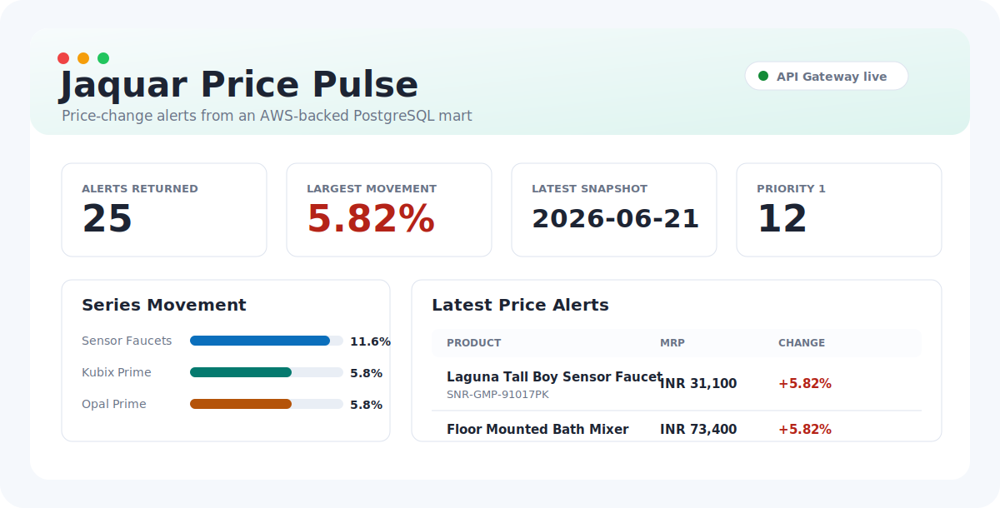
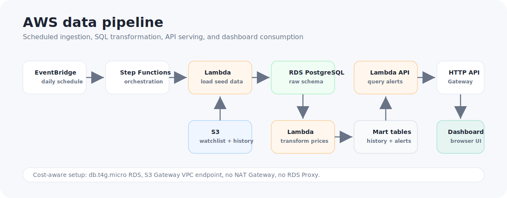
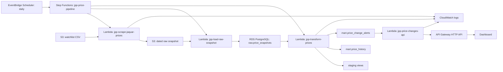

# Jaquar Price Pulse

Jaquar products are sold across dozens of regional distributors. Prices shift weekly with no centralised visibility; a procurement team checking 50 SKUs manually takes hours. This pipeline automates that workflow with scheduled snapshots, automatic change detection, and an alert API that flags what moved and by how much.

Jaquar Price Pulse is a serverless data engineering project for tracking faucet prices from a curated watchlist, modeling price movements, and exposing alert-ready changes through a REST API and dashboard.

<p align="center">
  
</p>

## Capabilities

- Live Jaquar product extraction using CSRF-aware variant API calls
- S3 raw snapshot and seed landing
- RDS PostgreSQL storage
- dbt transformation models and data quality tests
- SQL window functions for price-change history
- API-ready mart for products crossing alert thresholds
- AWS architecture using Lambda, Step Functions, EventBridge Scheduler, S3, RDS PostgreSQL, API Gateway, and CloudWatch
- Lightweight dashboard that consumes the live API endpoint

## Live Demo API

```text
https://g1csrs4cxh.execute-api.ap-south-1.amazonaws.com/price-changes?days=14&limit=5
```

The endpoint returns price-change alerts from the PostgreSQL mart table. Query parameters:

- `days`: lookback window from latest available snapshot, default `14`
- `limit`: max records to return, default `50`, max `200`
- `min_pct`: minimum absolute percentage movement, default `0`

## Local/RDS Bootstrap Flow

1. Load a 50-SKU watchlist from `data/jaquar_price_watchlist_50.csv`.
2. Load weekly synthetic seed history from `data/jaquar_price_history_seed_synthetic.csv`.
3. Create raw tables in PostgreSQL.
4. Run dbt models:
   - `stg_watchlist`
   - `stg_price_snapshots`
   - `price_history`
   - `price_change_alerts`

The synthetic history is clearly marked with `is_synthetic = true`. It bootstraps the time-series model until scheduled live snapshots accumulate.

## AWS Flow

The production flow is designed to append live Jaquar snapshots instead of repeatedly reloading the same seed file. The seed loader remains as a bootstrap/backfill utility.

1. EventBridge Scheduler runs daily.
2. Step Functions starts `jpp-price-pipeline`.
3. `jpp-scrape-jaquar-prices` reads the active watchlist from S3, calls Jaquar product pages and the internal variant endpoint, and writes a dated raw CSV to S3.
4. `jpp-load-raw-snapshot` reads that raw CSV from S3 and appends `is_synthetic = false` rows into `raw.price_snapshots`.
5. `jpp-transform-prices` rebuilds staging views and mart tables in PostgreSQL.
6. API Gateway serves `mart.price_change_alerts` through `jpp-price-changes-api`.
7. `dashboard/index.html` fetches the API and visualizes the latest alert set.

## Local Setup

Install dependencies:

```bash
python -m venv .venv
.venv\Scripts\activate
pip install -r requirements.txt
```

Configure local environment variables for PostgreSQL and S3 before running the bootstrap scripts. Then check DB connectivity:

```bash
python scripts/check_connection.py
```

Create schema and load seed data:

```bash
python scripts/load_seed.py
```

Upload seed files to S3:

```bash
python scripts/upload_seed_to_s3.py
```

Run dbt:

```bash
python scripts/run_dbt.py run
python scripts/run_dbt.py test
python scripts/show_alerts.py
```

Open the local dashboard:

```text
dashboard/index.html
```

Package the live scrape Lambda:

```powershell
.\scripts\package_scrape_jaquar_lambda.ps1 -Python .\.venv\Scripts\python.exe
```

Package the raw snapshot loader Lambda:

```powershell
.\scripts\package_load_raw_snapshot_lambda.ps1 -Python .\.venv\Scripts\python.exe
```


## Tables

`raw.watchlist`

Curated product list that controls which Jaquar products the pipeline tracks.

`raw.price_snapshots`

Append-only price observations by snapshot date and watch ID.

`mart.price_history`

Adds previous snapshot price, absolute price change, and percentage movement using SQL window functions.

`mart.price_change_alerts`

Filters `price_history` to rows where movement exceeds the SKU-specific threshold.

## AWS Architecture

<p align="center">
  
</p>



## Cost Controls

- RDS is `db.t4g.micro`, Single-AZ, 20 GiB, no storage autoscaling.
- S3 bucket is private.
- S3 Gateway VPC endpoint avoids NAT Gateway cost for S3 access from VPC Lambdas.
- No NAT Gateway, no RDS Proxy, no paid dashboards.
- EventBridge Scheduler triggers one low-volume Step Functions workflow per day.

## What I'd Do Differently At Scale

- Move from public RDS access to private subnets plus RDS Proxy once Lambda concurrency increases.
- Replace synthetic seed history with a formal backfill strategy built from historical raw snapshots.
- Add dbt source freshness tests so pipeline failures are caught before stale or incomplete data reaches the mart.

