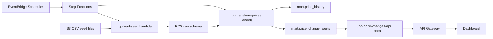

# Jaquar Price Pulse Interview Walkthrough

## 30-Second Version

I built a serverless data engineering project around a real Jaquar product scrape. The current AWS deployment loads a curated 50-SKU watchlist and seeded historical snapshots from S3, stores them in RDS PostgreSQL, transforms them into price-history and price-alert marts using SQL window functions, exposes alerts through API Gateway and Lambda, and runs daily through EventBridge Scheduler and Step Functions.

## What Is Real Today

- The original Jaquar faucet scrape produced 5,427 SKU rows.
- The deployed AWS pipeline is live and scheduled.
- RDS PostgreSQL stores raw, staging, and mart data.
- The API endpoint returns live data from the PostgreSQL mart.
- The dashboard consumes the API Gateway endpoint directly.

## What Is Seeded For Demo

Historical price movements are synthetic and flagged as `is_synthetic = true`. That was deliberate because product prices do not change every day, and a portfolio demo needs enough historical variation to prove the transformation logic.

## Current Pipeline

## Important Honesty Point

The current scheduled AWS pipeline does not scrape Jaquar live yet. It schedules the load and transform workflow from S3 seed files. The next upgrade is to add a `jpp-scrape-jaquar` Lambda at the start of the Step Functions workflow that fetches active watchlist products and appends a new daily snapshot to S3/RDS.

## Strong Technical Details To Mention

- Used PostgreSQL window functions with `lag()` to compare each SKU against its previous snapshot.
- Designed raw, staging, and mart layers to separate ingestion from analytics.
- Used SKU-specific thresholds so alerts are data driven, not hard-coded.
- Avoided NAT Gateway cost by using an S3 Gateway VPC endpoint.
- Kept RDS on `db.t4g.micro`, Single-AZ, 20 GiB, storage autoscaling off.
- Exposed the mart through an HTTP API, not direct database access.

## Resume Bullet

Built an end-to-end AWS serverless price-monitoring pipeline using S3, Lambda, RDS PostgreSQL, Step Functions, EventBridge Scheduler, API Gateway, Python, and SQL/dbt-style transformations to ingest Jaquar product watchlists, model historical price movement with window functions, validate data quality, and serve alert-ready changes through a REST API and dashboard.
