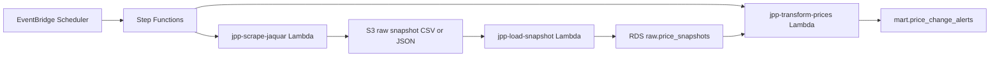

# Next Upgrade: Scheduled Live Jaquar Scrape

The deployed pipeline is currently scheduled, but it reloads S3 seed CSVs. To make the daily schedule scrape Jaquar live, add this component before `jpp-load-seed`.

## Target Flow

## Implementation Shape

1. Keep the 50-SKU watchlist in S3 or RDS.
2. Create `jpp-scrape-jaquar` Lambda that reads active watchlist URLs.
3. For each product, fetch the Jaquar page/API response and extract current MRP.
4. Write a dated raw snapshot to `s3://jaquar-price-pulse-kvs-20260621/raw/snapshot_date=YYYY-MM-DD/`.
5. Load that snapshot into `raw.price_snapshots` with `is_synthetic = false`.
6. Run the existing transform Lambda unchanged.

## Why This Matters

The current version covers cloud orchestration, storage, modeling, testing, and API delivery. The live-scrape upgrade adds production ingestion and idempotent daily snapshotting.

